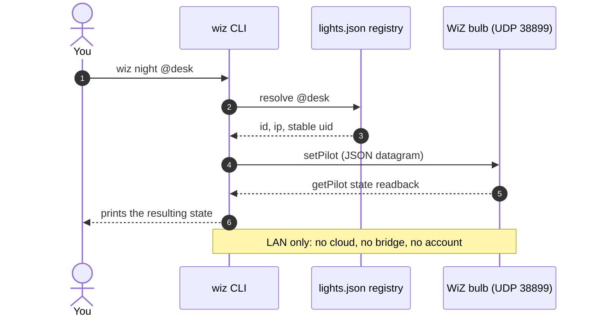
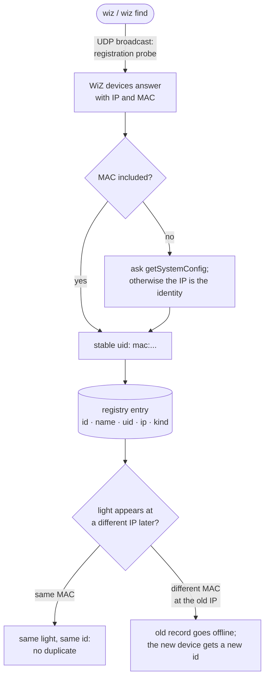

# wizterm


Control Philips WiZ smart lights from your terminal: no cloud, no bridge, and
no third-party dependencies. The command is named `wiz`.

```console
$ wiz
2 light(s):
  [  1] -            RGB            192.0.2.50       ON   dim=80%  mac=aa:bb:cc:dd:ee:ff
  [  2] desk         tunable white  192.0.2.51       off  dim=100%

The registry output shows the detected device kind (`RGB`, `tunable white`,
`dimmable`, or `unknown`) between the friendly name and IP address.

$ wiz rename desk @1
  [  1] desk         RGB            192.0.2.50       renamed to 'desk'

$ wiz night @desk
1 light(s):
  [  1] desk         RGB            192.0.2.50       -> ON   10%, 2700K
```

WiZ devices speak a local API over UDP port 38899. Discovery and control stay
on the same LAN as the lights; nothing is sent to a cloud service.

## How it works

A `wiz` command is one local process: it keeps identity state in a small
registry file and speaks the WiZ local protocol (JSON over UDP port 38899)
directly to the bulbs. There is no cloud service, bridge, or account anywhere
in the path.

### Control path



### Discovery and identity



## Install

### With your AI agent (recommended)

Paste this single line into any coding assistant: Claude Code, Codex, Cursor,
Hermes, or another agent:

```text
Install and set up https://github.com/himanusia/wizterm for me by following its README, then show me my lights.
```

The README is written so an agent can follow it end to end: detect the OS,
pick an install method, learn the commands, and verify with a local `wiz` call.

### Manual

**pipx / pip**

```sh
pipx install git+https://github.com/himanusia/wizterm.git
```

**curl** (macOS/Linux)

```sh
curl -fsSL https://raw.githubusercontent.com/himanusia/wizterm/main/wiz.py -o ~/.local/bin/wiz && chmod +x ~/.local/bin/wiz
```

Make sure `~/.local/bin` is on your `PATH`.

### Updating

```sh
wiz update --check                         # read-only check
wiz update                                  # CLI + active Hermes skill
wiz update --force                          # reapply the same/newer version
wiz update --ref <branch-or-tag>                # use an explicit source ref
wiz update --harness codex                  # also/update Codex global skill
wiz update --harness claude                 # also/update Claude Code skill
wiz update --harness opencode               # also/update OpenCode skill
wiz update --harness all                    # sync all supported skill targets
```

`wiz update` downloads `wiz.py`, `pyproject.toml`, and the portable WiZ skill over
HTTPS, checks that the source/package versions match, compiles the candidate
without executing it, refuses downgrades, then atomically updates the installed
`wiz` script and the selected skill targets. The default skill target
is the active Hermes skill under `HERMES_HOME`; the other global targets are:

- Codex: `~/.agents/skills/wiz-lan-control/SKILL.md`
- Claude Code: `~/.claude/skills/wiz-lan-control/SKILL.md`
- OpenCode: `~/.config/opencode/skills/wiz-lan-control/SKILL.md`

Use `--harness all` to update all four global targets explicitly. The updater
does not overwrite project-local skill copies or other Hermes profiles. Reload
the relevant harness session after a skill update. Use `--check` to avoid writes.

**Windows**: install Python first if needed (`winget install Python.Python.3`),
then save `wiz.py` anywhere and run `python wiz.py <command>`. Allow the
firewall prompt on first run.

## Usage

```text
wiz                          discover, then show tracked lights
wiz list                     show cached status without discovery
wiz find                     discover all WiZ lights
wiz find --include-forgotten re-adopt forgotten lights
wiz --version               print the CLI version
wiz update [options]        update CLI + selected agent skill copies
wiz on | off                 turn every tracked light on / off
wiz <10-100>                brightness percent (turns lights on)
wiz night | warm | white | cool
                             temperature presets
wiz temp <2700-6500>        color temperature in Kelvin
wiz preset                   list default lighting and color presets
wiz preset <name> [target]   apply a named lighting/color preset
wiz color <name> [target]   apply a named color preset
wiz rgb RRGGBB [target]     RGB color; also accepts `#RRGGBB`
wiz ambience                 list ambience/scene IDs and names
wiz ambience <id|name>      activate a known ambience
wiz scene <id|name>         alias for ambience
wiz rename <name> [target]  assign a friendly name
wiz forget [target]         remove light(s) from this CLI registry
wiz add <ip>                manually register a light by IP
wiz shows                   list the optional audio-reactive shows
wiz live [target]           audio-reactive visualizer (needs the live extra)
wiz detect [target]         identify the playing song (needs the recognize extra)
wiz caramelldansen [target] the meme: two colours swapping on every half beat
```

### Targeting one light

Targets can be a local numeric ID, a friendly name, or an IP address. A trailing
`@` makes the target explicit and is recommended in scripts. For interactive
use, target-first syntax is also accepted:

```sh
wiz rename desk @1
wiz on @desk
wiz 40 @desk
wiz warm 192.0.2.50
wiz off 2

wiz desk ambience romance
wiz desk on
wiz 2 cool
```

The target-first form is equivalent to the trailing-target form; both remain
supported. A name target is case-insensitive and supports a prefix. A command
without a target applies to every tracked light. Direct IP control also works
before a light has been registered.

### RGB and named presets

```sh
wiz rgb ff8800 @desk       # orange
wiz rgb '#ff8800' @desk    # same color; quote # in the shell
wiz preset                 # list default lighting and color presets
wiz preset night @desk
wiz preset orange @desk
wiz color blue @desk       # alias for a color preset
```

The default lighting presets are `night`, `warm`, `white`, and `cool`. Color
presets include `red`, `orange`, `yellow`, `green`, `cyan`, `blue`, `purple`,
`pink`, and `magenta`. RGB/color commands require a color-capable bulb; a
white-only bulb may ignore RGB values.

### Ambience / scenes

WiZ calls these light modes or effects in different app versions; the local
protocol sends them as `sceneId`. Ask the CLI for the catalog:

```sh
wiz ambience
wiz ambience help
wiz ambience 1 @desk          # Ocean
wiz ambience "Dim-to-warm" @desk
wiz scene 1000 @desk          # Rhythm
```

The help output includes standard IDs, `Rhythm`, and known custom-mode IDs.
Firmware and bulb class determine which entries actually work, and newer
firmware may expose additional IDs. Unknown numeric IDs remain accepted so the
CLI does not block a valid newer device mode.

### Forgetting and re-adopting

`forget` removes a light from the local registry. It does **not** turn off,
reset, or remove the physical bulb from the official WiZ app.

```sh
wiz forget @desk       # forget one light by name
wiz forget @1          # forget one light by numeric ID
wiz forget 192.0.2.50
wiz forget             # forget every tracked light
wiz find --include-forgotten  # discover and re-adopt forgotten lights
```

Forgotten devices are ignored by normal automatic discovery. Re-adopting one
creates a new local numeric ID; its old ID is not reused.

## State and migration

The registry is stored at `~/.config/wiz/lights.json`. The CLI migrates
the earlier format containing only `ip` and `name` entries the first time it
writes the file. The v2 shape contains a numeric `id`, a stable WiZ `uid` when
the device reports its MAC, the current `ip`, and the local `name`.

If a different MAC appears on an IP previously used by another tracked light,
the old record is retained as offline and the new device gets a separate ID.
This prevents a reused DHCP address from inheriting the old light's name.

The numeric ID is a local handle, not a WiZ cloud/account ID. The MAC-derived
UID is what lets discovery associate the same bulb after a DHCP address change.
If a particular firmware does not report a MAC, the current IP is the fallback
identity and can change with DHCP.

## Using with AI agents

`wiz` is deliberately agent-friendly: one command surface, plain-text output,
meaningful exit codes, no interactivity, and no cloud calls. A ready-made agent
skill ships at [`skills/wiz/SKILL.md`](skills/wiz/SKILL.md).

## Supported hardware

Any WiZ-connected bulb speaking the local API works, including:

- full-color models (`rgb` supported),
- tunable-white models (typically 2700–6500 K),
- dimmable-only models (brightness).

Commands outside a bulb's capabilities may be silently ignored by the bulb;
where applicable, `wiz` reads the resulting state back after a write.

## Live shows (optional)

`wiz live` turns the bulbs into an audio-reactive visualizer. The audio stack
is deliberately kept out of the core CLI: `wiz.py` stays dependency-free and
loads `wiz_live.py` only when you ask for a show.

### Install the extras

```sh
pipx install "wizterm[live]"                 # visualizer only
pipx install "wizterm[live,recognize]"       # plus song identification
# or, without installing anything:
uv run --with numpy --with sounddevice wiz_live.py live --source mic
```

`wiz_live.py` must sit next to the `wiz` script (or set `WIZ_LIVE_HOME` to the
directory that contains it). With the curl install, drop the file next to it:

```sh
curl -fsSL https://raw.githubusercontent.com/himanusia/wizterm/main/wiz_live.py \
  -o ~/.local/bin/wiz_live.py
```

Then `pip install numpy sounddevice shazamio` (or use the venv of your choice).

### Commands

```sh
wiz shows                                  # list modes
wiz live                                   # microphone, default mode
wiz live @lamp --mode spectrum             # one light, punchier mode
wiz live @lamp --source file song.mp3      # repeatable, perfectly synced demo
wiz live @lamp --source system             # system audio (loopback device)
wiz detect --seconds 8                     # identify the song playing
wiz detect --apply                         # identify, then start its show
wiz caramelldansen @lamp                   # the meme, 165 BPM
wiz caramelldansen @lamp --dry-run         # print frames, send nothing
```

### Modes

| Mode | Behaviour |
|---|---|
| `bands` | bass to red, mid to green, treble to blue (default) |
| `energy` | warm colour when loud, cool when quiet |
| `rainbow` | hue follows the dominant band |
| `pulse` | fixed warm colour, brightness follows the music |
| `strobe` | white flash on every detected beat |
| `spectrum` | colour hint plus an aggressive brightness pulse |
| `multi` | one frequency band per light, for two or more bulbs |
| `caramelldansen` | two colours swapping on every half beat |

Useful flags: `--fps` (frames sent per second, default 12), `--sensitivity`,
`--brightness-boost`, `--duration`, `--dry-run`, `--list-devices`.

### Audio sources

- `mic` (default): the machine microphone; works everywhere.
- `file`: decode any ffmpeg-readable file, so a demo looks the same every time.
- `system`: capture what the machine is playing. On macOS this needs a
  loopback driver (BlackHole, Loopback, ...) routed as an input device; on
  Linux use a monitor source; on Windows use Stereo Mix or VB-Cable.

### Detecting the song

`wiz detect` records a few seconds (or reads `--file`), asks Shazam what is
playing, prints the match, and with `--apply` starts the show that matches.
Known meme titles in `KNOWN_MEMES` auto-select their show, so a recognised
Caramelldansen goes straight to `wiz caramelldansen`.

### Etiquette and limits

- Bulbs accept a limited update rate. Keep `--fps` at or below ~15 and avoid
  sending unchanged frames; `wiz live` skips identical frames automatically.
- RGB modes do nothing on tunable-white or dimmable-only bulbs; `wiz live`
  prints a note for those targets in advance.
- Before a show starts, `wiz live` snapshots each light and restores that state
  when the show stops, including on Ctrl-C. `--dry-run` sends no UDP at all.
- Everything is LAN-only, exactly like the control commands.

## Protocol and security

The WiZ Local API is undocumented but widely implemented: JSON datagrams over
UDP port 38899, unauthenticated, LAN-only.

- `getPilot` reads current state (power, dimming, temperature, color, scene).
- `setPilot` applies changes (`state`, `dimming`, `temp`, `r/g/b`, `sceneId`).
- Discovery broadcasts a `registration` probe; bulbs answer with their IP and,
  on supported firmware, a MAC address. If the registration response omits the
  MAC, `wiz` asks `getSystemConfig` for it before merging the device into the
  local registry.

Anything on the local network may be able to control these bulbs because the
firmware protocol has no authentication. Do not expose this script as an
internet-facing service.

## Scope

Implemented here: local discovery, registry IDs/names, on/off, brightness,
color temperature, RGB, named lighting/color presets, known ambience/scene
activation, safe forgetting/re-adoption, and optional audio-reactive shows
(`wiz live`, `wiz detect`, `wiz caramelldansen`) in a separate module.

Not implemented here: WiZ account/cloud control, rooms/groups managed by the
app, schedules and automations, WiZclick, custom light-mode/gradient editing,
dynamic-effect speed controls, firmware/pairing/reset operations, sensors and
other accessories, and device-specific capabilities outside the basic local
pilot API. The official app may expose more features than this LAN CLI.

## Development

```sh
python3 -m unittest discover -s tests -v
python3 -m py_compile wiz.py wiz_live.py
```

## License

MIT
